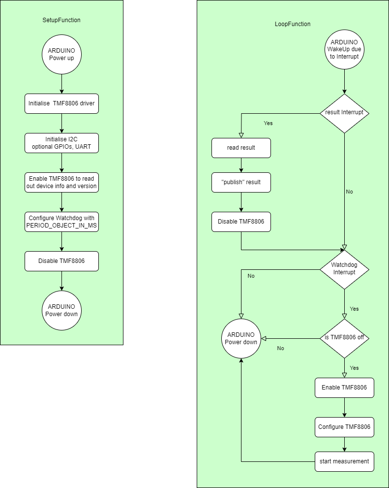
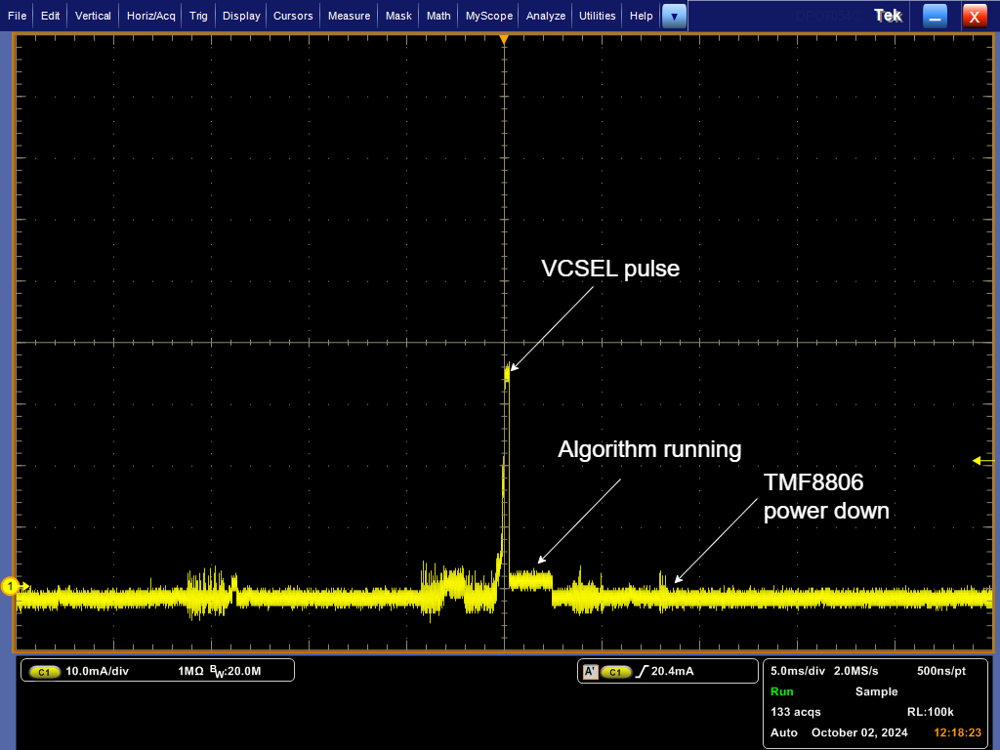
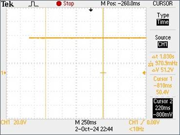
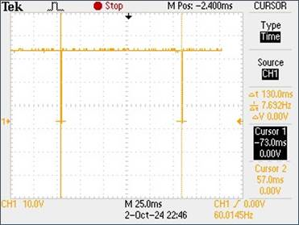
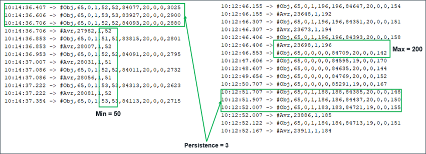
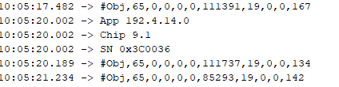
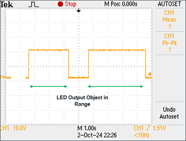
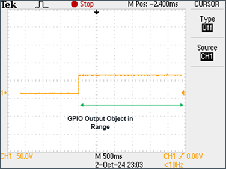

# TMF8806 (Time-of-flight) Low-Power Arduino Uno application  

This is a low-power example which shows how to use the TMF8806 in applications that are battery powered. 

## Requirements  

- an Arduino Uno R3 board 
- an ams TMF8806 Arduino Shield Board [TMF8806_EVM_EB_SHIELD](https://ams-osram.com/search?q=tmf8806)
- a USB B cable
- the [Arduino IDE](https://www.arduino.cc/en/software) to compile and download the Arduino Uno example application

## Files  

The arduino project consists of the following files:

- **tmf8806_low_power.ino** - the arduino specific wrapper for the application
- **tmf8806_app.h** and **tmf8806_app.c** - the TMF8806 low-power application itself
- **tmf8806.h** and **tmf8806.c** - the TMF8806 driver 
- **tmf8806_shim.h** and **tmf8806_shim.cpp** - a shim to abstract the arduino specific I2C, UART, GPIO and low-power functions
For the Arduino this needs to be a c++ file. However the shim layer for other platforms could also be a plain C file.

## Configuration

The low power example is written with compile-time configuration. The compile time configuration can be changed by modifying the
following defines in the file **tmf8806_app.h**:

- **KILO_ITERATIONS** defines the number of integrations. The range is 10 - 4000, which is internally multiplied by 1000 (as these
are kilo-iterations).  
- **PERIOD_NO_OBJECT_IN_MS** defines the interval with which single shot measurements are executed when no object is detected in 
the specified distance range (see parameters LOW_THESHOLD_MM and HIGH_THRESHOLD_MM). Note that the arduino uno uses for this
purpose the watchdog timer which is limited in the available timing configuration to: 16ms, 32ms, 64ms, 128ms, 256ms 512ms, 512ms
1024ms 2048ms 4096ms and 8192ms. The application will use an interval that is equal or bigger than the given PERIOD_NO_OBJECT_IN_MS. If it the number is greater than 8192 it will automatically be set to 8192.
- **PERIOD_OBJECT_IN_MS** defines the interval with which single shot measurements are executed when an object is in the specified range.
Same restrictions as for PERIOD_NO_OBJECT_IN_MS apply for this constant.
- **PERSISTENCE** - defines many consecutive times any object has to be in the specified range before a "object-in-range" is signalled 
(via UART and/or GPIO and/or LED). The value 0 has the special meaning that every object (including out-of-range objects) are reported. 
E.g. a value of 3 means that there have to be 3 measurements in a row with: HIGH_THRESHOLD_MM >= object distance >= LOW_THRESHOLD_MM. 
- **LOW_THRESHOLD_MM** - defines the minimum distance an object must have to be considered in range 
- **HIGH_THRESHOLD_MM** - defines the minimum distance an object must have to be considered in range 

- **OUTPUT_ON_UART** - if set to 1 results will be published on UART. If set to 0 the code that writes to the UART will be removed from the binary image. The configuration of the UART is 115200 baud, 8-bit data, 1 stop bit, no parity bit.
- **OUTPUT_ON_LED** - if set to 1 and if an object is for at least PERSISTENCE measurements in a series in range the arduino built-in led will be on, else the led will be off. Note that the bootloader of the arduino also uses the built-in led during boot process so it will aso be on during booting. If set to 0 the code controlling the built-in led is removed from the binary image and the led will be in the state defined by the arduino uno bootloader.
- **OUTPUT_ON_GPIO** - if set to 1 and if an object is for at least PERSISTENCE measurements in a series in range the gpio defined in file tmf8806_shim.h as **RESULT_PIN** will be high, else the pin will be low. If set to 0 the code controlling the gpio pin is removed from the binary image and the pin will be in the default state defined by the arduino uno.

**Note:** The total integration time is the maximum of these 2 values: 
1. Integration time defined through KILO_ITERATIONS plus data processing time and algorithm publishing time 
2. Period of measurements
E.g. if the period is shorter than the integration time than the measurements will happen with the period of the integration time.

## Application control flow

The application itself has 2 functions that are called from the arduino framework (see **tmf8806_low_power.ino** file):
1. void setup( ) - is called only once after power up of the arduino
2. void loop( ) - is called periodically while the arduino is running

To have a portable application the actual code of the **setup** function and the **loop** function is implemented in the file **tmf8806_app.c**.
The flow chart below shows the control flow of the application.

 

## Porting to another MCU

To port the driver and application to another platform you need to adapt the following files:    
- **tmf8806_a.ino** - the arduino specific wrapper for the application, replace this with the requirements for your selected platform
- **tmf8806_shim.h** and **tmf8806_shim.cpp** - a shim to abstract the arduino specific functions

The shim layer contains all arduino uno specific code and defines like e.g. which pin is used for the ENABLE line of the TMF8806, which pin is used for the INTERRUPT line of the TMF8806, which pin shall be used to signal that an object is in range.
The arduino uno is an 8-bit processor which has some limitation on the I2C. the 2 most stringent are
- maximum I2C frequency is 400KHz
- maximum I2C block transfer size is 32 bytes (including the register address byte)

## Measurement result

### Current measurement
Using default settings, the measured average current is only 26 uA.

Power consumption profile: 

  x-axis: 200ms/div
  y-axis: 10mA/div

Power consumption profile zoomed in: 

  x-axis: 10ms/div
  y-axis: 10mA/div

### Check functionality using default settings
Setup with no object in front. Expected period in ms: 1024
  Measured INT Line: 1030 ms 

Setup with object in front. Expected period in ms: 128
  Measured INT Line: 130 ms 

Persistence: 3
 Low Threshold: 50
 High Threshold: 200 

Output on UART: ON 

Output on LED: ON 

Output on GPIO: ON 

